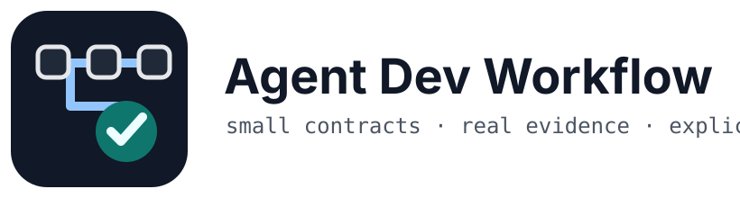
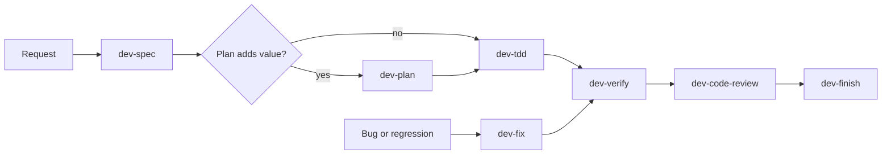

<p align="center">
  
</p>

# Agent Dev Workflow

A small set of skills and rules for coding agents that need to move from a request to verified, reviewed work without turning every change into a ceremony.

> Work in progress. The workflow is intentionally small and will change as we test it on real coding tasks.

## What this solves

Coding agents are good at producing code. They are less reliable at knowing when requirements are still unclear, when a plan is actually useful, whether a bug fix addresses the cause, and what evidence is enough to call work done.

Agent Dev Workflow puts explicit boundaries around those decisions. Small work stays small. Risky work gets more structure. Verification and review stay separate from implementation.

## Install

Clone the repository and install the skills into Codex:

```bash
git clone https://github.com/brutuscat/agent-dev-workflow.git
cd agent-dev-workflow
bash scripts/install-codex-skills.sh
```

The installer validates and stages all eight skills before changing the target. It refuses unmanaged same-named directories and preserves the previous managed installation in a backup when replacing it.

To fast-forward the current branch and install that revision:

```bash
bash scripts/install-codex-skills.sh --upgrade
```

`--upgrade` requires an attached Git branch with an upstream. It works from normal clones and linked worktrees.

If you installed the older 13-skill package, migrate it once with:

```bash
bash scripts/install-codex-skills.sh --upgrade --migrate-legacy
```

`--migrate-legacy` explicitly takes over pre-manifest same-named directories. Retired skills and replaced content move to the backup path printed by the installer; they are not silently deleted.

The installer uses `${CODEX_SKILLS_DIR}` when set, otherwise `${CODEX_HOME:-$HOME/.codex}/skills`.

## Use it

You can call a skill directly when you know what you need:

```text
Use $dev-spec to turn this request into a small acceptance contract.
Use $dev-plan to plan this migration before touching code.
Use $dev-tdd to implement this scoped behavior.
Use $dev-fix to reproduce and fix this regression.
Use $dev-verify to prove the change is ready.
Use $dev-code-review to review the current diff.
Use $dev-finish to prepare the authorized commit or PR.
```

If the next step is unclear, use `$dev-auto`. It recommends the next useful step from current evidence. It does not secretly run the rest of the workflow.

## The workflow



This is a map, not a mandatory pipeline. A typo may need only an edit and a diff check. A known one-line behavior change may start at `dev-tdd`. A bug normally starts at `dev-fix`, which already owns reproduction and regression evidence.

See [docs/workflow.md](docs/workflow.md) for the handoff rules.

## Skills

| Skill | Use it when | Outcome |
|---|---|---|
| [`dev-auto`](skills/dev-auto/) | You need workflow routing | One justified next step |
| [`dev-spec`](skills/dev-spec/) | Behavior, scope, or acceptance needs to be explicit | A small spec or a clearly named blocker |
| [`dev-plan`](skills/dev-plan/) | The implementation has meaningful dependencies, trade-offs, or risk | A repository-grounded implementation plan |
| [`dev-tdd`](skills/dev-tdd/) | You know the behavior to implement | Focused behavior proof and the smallest coherent change |
| [`dev-fix`](skills/dev-fix/) | Something is broken and the cause is not yet proven | Reproduction, root cause, scoped fix, regression evidence |
| [`dev-verify`](skills/dev-verify/) | Someone is about to claim the work is done | Evidence matched to the claim |
| [`dev-code-review`](skills/dev-code-review/) | A diff needs an independent defect pass | Actionable findings, not style noise |
| [`dev-finish`](skills/dev-finish/) | Verified work needs an authorized Git delivery action | Commit, PR, merge, preserve, or discard with exact scope |

Every skill uses the same four baseline rules: do not guess when a material decision is missing, keep changes narrow, preserve existing work, and make completion claims from evidence.

## Multi-agent work

Multiple agents help when work can be split cleanly. They hurt when ownership overlaps or a reviewer simply repeats the author's conclusion.

The main agent owns user communication, decomposition, integration, Git mutations, and the final claim. Workers get explicit write scopes. Verifiers and reviewers stay independent when the runtime can provide a genuinely separate agent.

See [docs/multi-agent.md](docs/multi-agent.md) for the delegation contract.

## What this does not do

- It is not an autonomous orchestration runtime.
- `dev-auto` does not invoke other skills.
- A spec or plan file does not grant implementation or Git authorization.
- Passing tests do not replace code review, and a clean review does not prove tests ran.
- Multi-agent labels inside one context are not independent review.
- Small changes do not need artificial specs, plans, or tests.

## Repository rules

[`AGENTS.md`](AGENTS.md) is the short, always-on guide for agents working on this repository. The detailed behavior lives in the skills, not in a giant root prompt.

Run the repository checks with:

```bash
bash scripts/validate-repo.sh
bash scripts/test.sh
```

## License

MIT. See [LICENSE](LICENSE).
