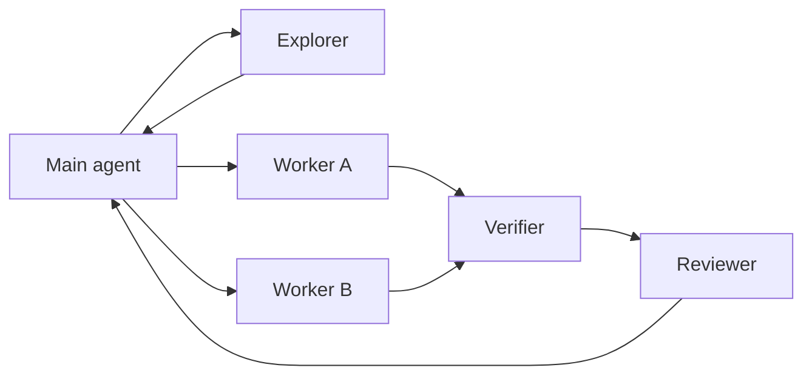

# Multi-agent work

Use multiple agents to reduce uncertainty or wall-clock work, not to manufacture consensus.

The main agent remains responsible for the task.

## Ownership

The main agent owns:

- user communication and unresolved decisions;
- task decomposition;
- the final integrated diff;
- Git mutations;
- the final completion claim.

A delegated agent owns only the scope in its assignment.

## Delegate when

Delegate when the task is bounded, ownership is clear, the result can be checked, and the worker does not need a user decision.

Good examples:

- trace one call path;
- inspect how similar code handles an error;
- implement a module with disjoint file ownership;
- run verification against the final snapshot;
- review a diff the reviewer did not author.

Do not delegate overlapping writes, final Git delivery, destructive cleanup, or product decisions that still need the user.

## Assignment contract

Give every delegated task this minimum contract:

```text
Objective:
Source:
Read scope:
Write scope:
Do not edit:
Verification:
Return:
```

`Write scope: read-only` is valid and should be explicit for explorers, verifiers, and reviewers.

Workers return changed files, commands run, observed results, and remaining risks. A summary without evidence is not a completion signal.

## Roles

| Role | Owns | Does not own |
|---|---|---|
| Explorer | Repository facts, call paths, similar patterns | Product decisions or code changes unless reassigned |
| Worker | One bounded implementation scope | Other workers' files, final integration, Git delivery |
| Verifier | Evidence for specified claims | Fixing the code while acting as independent verifier |
| Reviewer | Defect review of the requested diff | Rewriting the implementation during the review pass |

A role name does not make an agent independent. If the runtime cannot create a separate context, call it a self-check.

## Parallel work

Parallel workers are safe only when write scopes are disjoint.



If two tasks need the same files, serialize them or keep the work with one owner.

## Review and verification

Verification and review answer different questions.

- Verification asks: does the evidence support the requested behavior and completion claim?
- Review asks: does the diff introduce a bug, regression, integration gap, or material risk?

A worker's successful test summary is not independent verification. A reviewer's `READY` result does not prove tests ran.

The main agent inspects delegated output before using it.

## Failure handling

If a worker finds scope drift, conflicting ownership, or a missing product decision, it reports the blocker and stops the dependent change.

If a verifier or reviewer finds a problem, the main agent routes the finding back to the appropriate implementation owner, then reruns only the affected checks.

Do not retry the same failed approach without new evidence.
